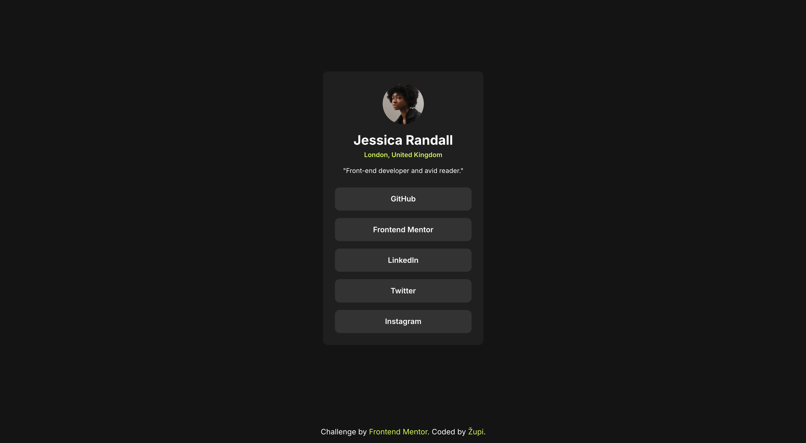

# Frontend Mentor - Social links profile solution

This is a solution to the [Social links profile challenge on Frontend Mentor](https://www.frontendmentor.io/challenges/social-links-profile-UG32l9m6dQ). Frontend Mentor challenges help you improve your coding skills by building realistic projects.

## Table of contents

- [Overview](#overview)
  - [The challenge](#the-challenge)
  - [Screenshot](#screenshot)
  - [Links](#links)
- [My process](#my-process)
  - [Built with](#built-with)
  - [What I learned](#what-i-learned)
- [Author](#author)

## Overview

### The challenge

Users should be able to:

- See hover and focus states for all interactive elements on the page

### Screenshot



### Links

- Solution URL: [Github Repo](https://github.com/Zupi-HR/Social-links-profile)
- Live Site URL: [Live Version](https://zupi-hr.github.io/Social-links-profile/)

## My process

### Built with

- Semantic HTML5 markup
- CSS custom properties
- Flexbox
- Grid
- Mobile-first workflow

### What I learned

This project was a great opportunity to practice responsive design and solidify my understanding of which CSS units to use for different purposes. I focused on creating a fluid and accessible layout that adapts to various screen sizes.

One of the key techniques I implemented was using the `clamp()` function for fluid typography. This allows the font size to scale smoothly with the viewport width between a minimum and maximum value, which is more efficient than writing multiple media queries.

```css
.profile-card__name {
  font-size: clamp(1.5rem, 1.2rem + 1vw, 1.75rem);
}
```

I also made deliberate choices for other units throughout the project:

- **`rem`**: Used for most `font-size`, `padding`, and `margin` values. This ensures the layout scales predictably with the user's browser font-size settings, which is crucial for accessibility.
- **`%`**: Used for the main card's `width` and the avatar's `width` to make them fluid and responsive to their parent container's size.
- **`vh`**: Used on the `body`'s `min-height` to ensure the content card is always centered vertically, even on short content pages.

## Author

- Coded by - [Župi](https://github.com/Zupi-HR)
- Frontend Mentor - [@Zupi-HR](https://www.frontendmentor.io/profile/Zupi-HR)
